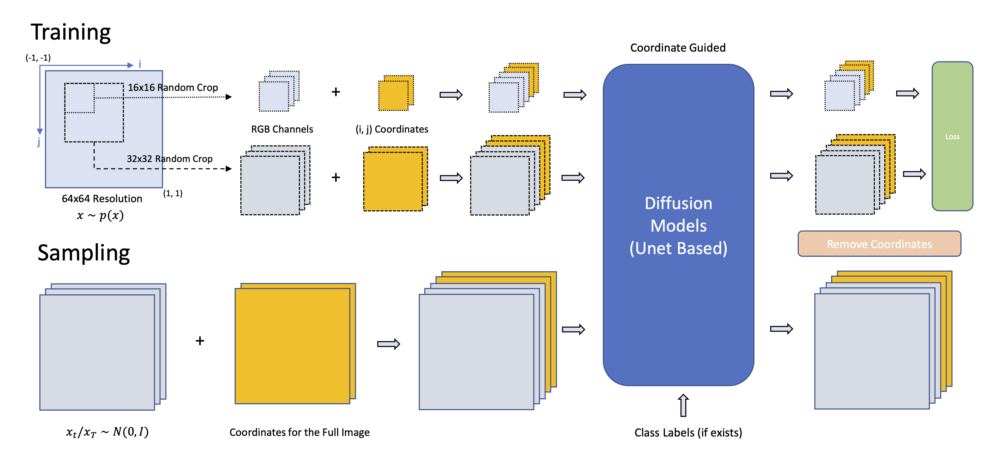

## Patch Diffusion: Faster and More Data-Efficient Training of Diffusion Models<br><sub>Official PyTorch implementation</sub>



**Patch Diffusion: Faster and More Data-Efficient Training of Diffusion Models**<br>
Zhendong Wang, Yifan Jiang, Huangjie Zheng, Peihao Wang, Pengcheng He, Zhangyang Wang, Weizhu Chen, Mingyuan Zhou
<br>https://arxiv.org/abs/2304.12526 <br>

Abstract: *Diffusion models are powerful, but they require a lot of time and data to train. We propose **Patch Diffusion**, a generic patch-wise training framework, to significantly reduce the training time costs while improving data efficiency, which thus helps democratize diffusion model training to broader users. At the core of our innovations is a new conditional score function at the patch level, where the patch location in the original image is included as additional coordinate channels, while the patch size is randomized and diversified throughout training to encode the cross-region dependency at multiple scales. Sampling with our method is as easy as in the original diffusion model. Through Patch Diffusion, we could achieve 2x faster training, while maintaining comparable or better generation quality. Patch Diffusion meanwhile improves the performance of diffusion models trained on relatively small datasets, e.g., as few as 5,000 images to train from scratch. We achieve state-of-the-art FID scores 1.77 on CelebA-64x64 and 1.93 on AFHQv2-Wild-64x64. We share our code and pre-trained models here.*


## Requirements

* We build our Patch Diffusion upon the [EDM](https://github.com/NVlabs/edm) code base and the python environment set up is similar.
* Python libraries: See [environment.yml](./environment.yml) for exact library dependencies. You can use the following commands with Miniconda3 to create and activate your Python environment:
  - `conda env create -f environment.yml -n edm`
  - `conda activate edm`
* Docker users:
  - Ensure you have correctly installed the [NVIDIA container runtime](https://docs.docker.com/config/containers/resource_constraints/#gpu).
  - Use the [provided Dockerfile](./Dockerfile) to build an image with the required library dependencies.

## Getting started

### Preparing datasets

Download the dataset that you want to try on, such as [CelebA](http://mmlab.ie.cuhk.edu.hk/projects/CelebA.html), [FFHQ](https://github.com/NVlabs/ffhq-dataset), [LSUN](https://github.com/fyu/lsun), [ImageNet](https://image-net.org/index.php).
Resize the image to the desired resolution, e.g., 64x64 here, and compute the fid-reference file for the preparation of fid computation, as follows:
```.bash
python dataset_tool.py --source=downloads/{dataset_folder} \
    --dest=datasets/{data_name}.zip --resolution=64x64 --transform=center-crop
python fid.py ref --data=datasets/{data_name}.zip --dest=fid-refs/{data_name}-64x64.npz
```

### Train Patch Diffusion

You can train new models using `train.py`. For example:

```.bash
# Train DDPM++ model for CelebA-64x64 using 8 GPUs
torchrun --standalone --nproc_per_node=8 train.py --outdir=training-runs \
    --data=datasets/celeba-64x64.zip --cond=0 --arch=ddpmpp --batch=256 \
    --cres=1,2,2,2 --lr=2e-4 --dropout=0.05 --augment=0 --real_p=0.5 
    
# Train ADM model with Latent Diffusion Encoder for LSUN-256x256 using 8 GPUs
torchrun --standalone --nproc_per_node=8 train.py --outdir=training-runs \
    --data=datasets/lsun-bedroom-256x256.zip --cond=0 --arch=adm --train_on_latents=1 \
    --duration=200 --batch-gpu=32 --batch=1024 --lr=1e-4 --ema=50 --dropout=0.10 --fp16=1 --ls=100 \
    --augment=0 --real_p=0.5
    
# Train ADM model with Latent Diffusion Encoder for ImageNet-256x256 using 8 GPUs
torchrun --standalone --nproc_per_node=8 train.py --outdir=training-runs \
    --data=datasets/imagenet-256x256.zip --cond=1 --arch=adm --train_on_latents=1 \
    --duration=2500 --batch-gpu=32 --batch=4096 --lr=1e-4 --ema=50 --dropout=0.10 --fp16=1 --ls=100 \
    --augment=0 --real_p=0.5 --tick=200
```

We follow the hyperparameter settings of EDM, and introduce two new parameters here:

- `--real_p`: the ratio of full size image used in the training.
- `--train_on_latents`: where to train on the Latent Diffusion latent space, instead of the pixel space. Note we trained our models on the latent space for 256x256 images. 

### Inference Patch Diffusion

You can generate images using `generate.py`. For example:
```.bash
# For DDPM++ Architecture we use
torchrun --standalone --nproc_per_node=8 generate.py --steps=50 --resolution 64 --batch 64 --outdir=fid-tmp --seeds=0-49999 --subdirs --network=/path-to-the-pkl/

# For ADM Architecture we use
torchrun --standalone --nproc_per_node=8 generate.py --steps=256 --S_churn=40 --S_min=0.05 --S_max=50 --S_noise=1.003 --resolution 32 --on_latents=1 --batch 64 --outdir=fid-tmp --seeds=0-49999 --subdirs --network=/path-to-the-pkl/
```

The model checkpoints that we trained will be released soon. 

### Calculating FID

To compute Fr&eacute;chet inception distance (FID) for a given model and sampler, first generate 50,000 random images and then compare them against the dataset reference statistics using `fid.py`:

```.bash
# Generate 50000 images and save them as fid-tmp/*/*.png
torchrun --standalone --nproc_per_node=1 generate.py --outdir=fid-tmp --seeds=0-49999 --subdirs \
    --network=https://nvlabs-fi-cdn.nvidia.com/edm/pretrained/edm-cifar10-32x32-cond-vp.pkl

# Calculate FID
torchrun --standalone --nproc_per_node=1 fid.py calc --images=fid-tmp \
    --ref=https://nvlabs-fi-cdn.nvidia.com/edm/fid-refs/cifar10-32x32.npz
```

Both of the above commands can be parallelized across multiple GPUs by adjusting `--nproc_per_node`. The second command typically takes 1-3 minutes in practice, but the first one can sometimes take several hours, depending on the configuration. See [`python fid.py --help`](./docs/fid-help.txt) for the full list of options.


## Citation

```
@article{wang2023patch,
  title={Patch Diffusion: Faster and More Data-Efficient Training of Diffusion Models},
  author={Wang, Zhendong and Jiang, Yifan and Zheng, Huangjie and Wang, Peihao and He, Pengcheng and Wang, Zhangyang and Chen, Weizhu and Zhou, Mingyuan},
  journal={arXiv preprint arXiv:2304.12526},
  year={2023}
}
```

## Acknowledgments

We thank [EDM](https://github.com/NVlabs/edm) authors for providing the great code base and [HuggingFace](https://huggingface.co/) for providing the easy access of Stable Diffusion Auto-Encoders.
